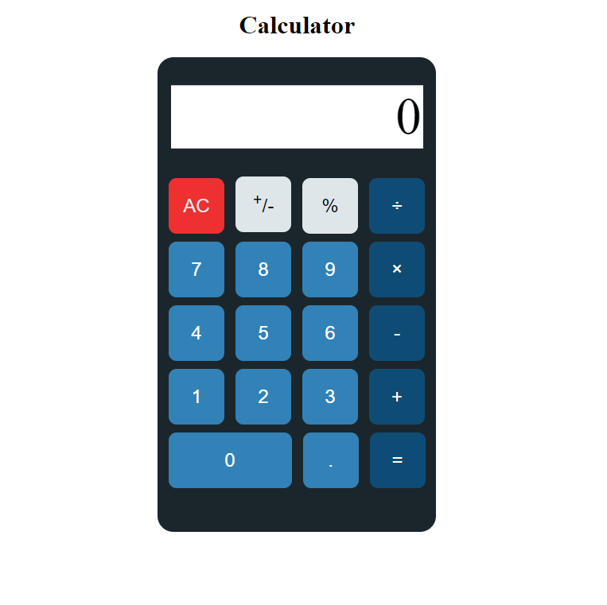

# calculator
A basic calculator made from vanilla JavaScript.  
This calculator is designed to mimic the functionality of an iPhone calculator.  
The problem of floating point imprecision does not exist!  

